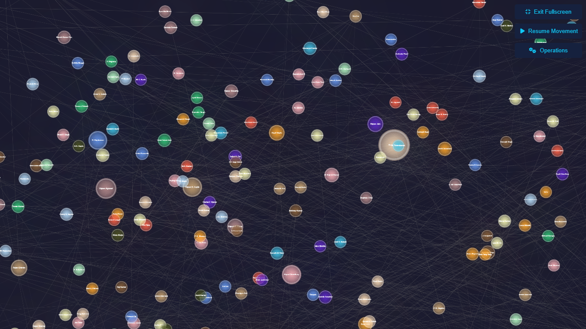
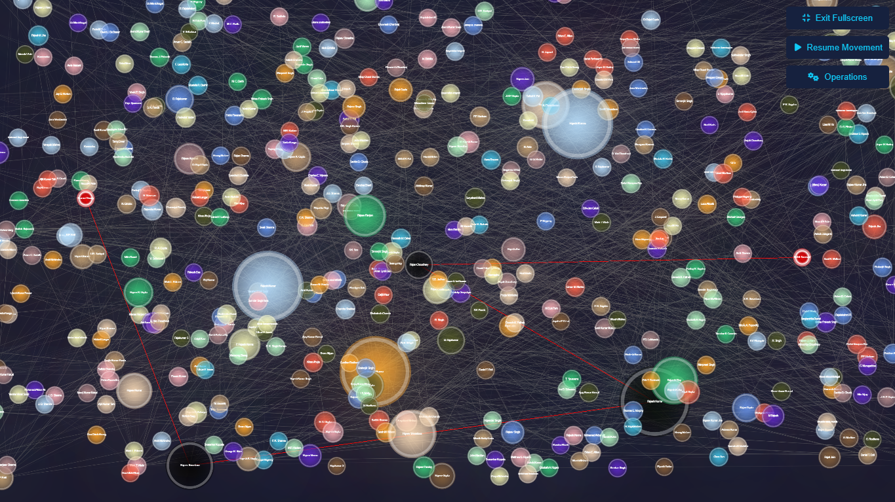
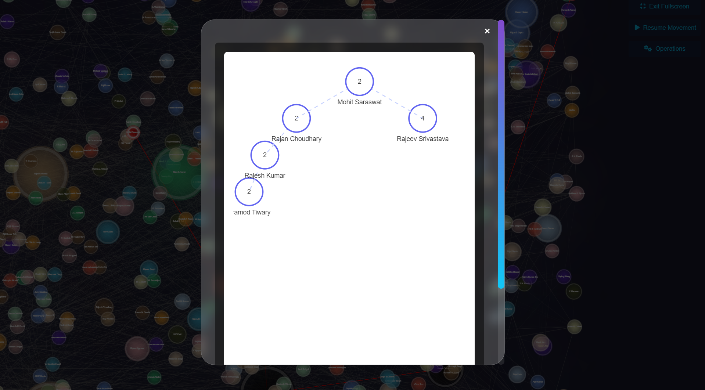
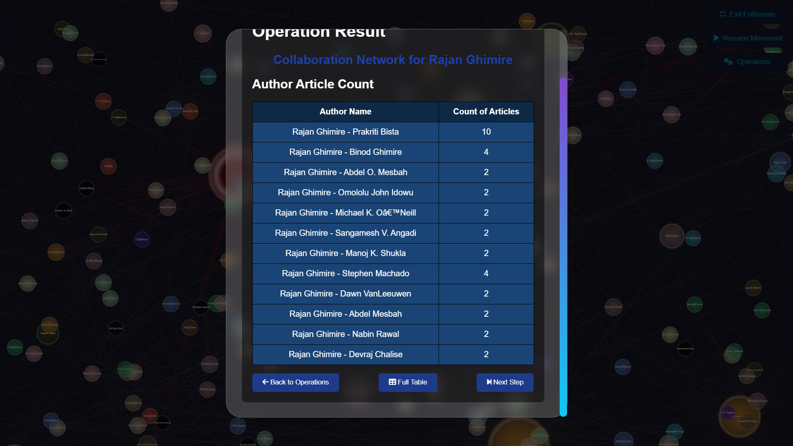
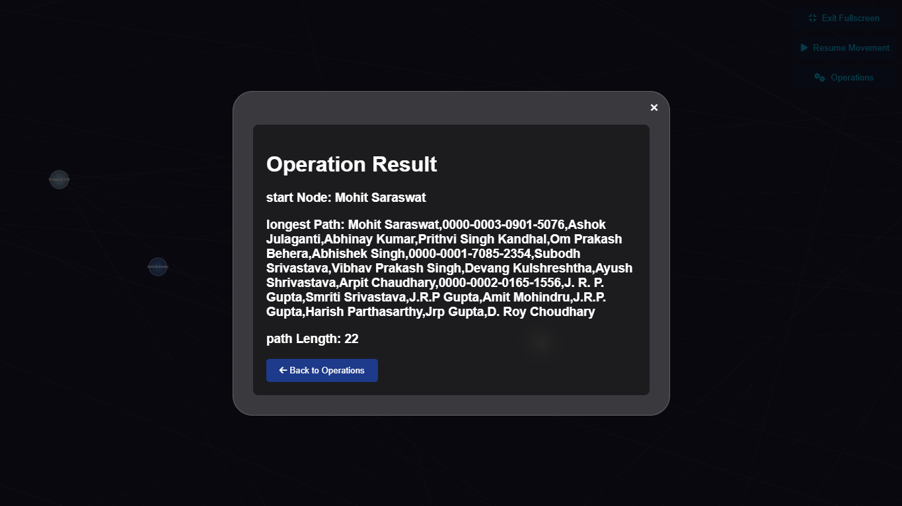

# Author Collaboration Network Visualization 🌐

This project is a web-based visualization tool for analyzing and exploring author collaboration networks. It uses Django as the backend framework and JavaScript (with HTML5 Canvas) for the frontend visualization. The tool allows users to interact with a network graph of authors, explore their collaborations, and perform various operations like finding the shortest path between authors, creating collaboration queues, and more.

## Features ✨

- **Interactive Network Graph**: Visualize author collaborations as a dynamic, interactive graph. 📊
- **Custom Context Menu**: Right-click on the graph to access a custom context menu with options like centering the view, showing node info, searching nodes, and more. 🖱️
- **Shortest Path Between Authors**: Find the shortest collaboration path between two authors. 🛤️
- **Author Collaboration Queue**: Create a queue of authors based on their collaboration counts. 📚
- **Binary Search Tree**: Generate a binary search tree from the collaboration data using **D3.js**. 🌳
- **Collaborator Shortest Paths**: Calculate the shortest paths for a given author's collaborators. 🗺️
- **Count Collaborators**: Count the number of collaborators for a specific author. 🔢
- **Most Collaborative Author**: Identify the author with the most collaborations. 🏆
- **Longest Path for Author**: Find the longest collaboration path for a given author. 🏁

## Technologies Used 🛠️

- **Backend**: Django (Python) 🐍
- **Frontend**: HTML5, CSS (SCSS), JavaScript (Canvas API) 🎨
- **Data Handling**: Pandas (for Excel file processing) 📄
- **Visualization**: Custom JavaScript-based graph rendering 🖼️
- **Tree Visualization**: D3.js (for binary search tree visualization) 🌲

## Screenshots 📸

|1. Interactive Network Graph |2. Custom Context Menu |
|:---:|:---:|
|  | |
| 3. Shortest Path Between Authors | 4. Binary Search Tree Visualization (D3.js) | 
|  | |
| 5. Author Collaboration Queue | 6. Longest Path for Author |
|  | |

## Getting Started 🚀

### Prerequisites

- Python 3.x 🐍
- Django 🖥️
- Pandas 📊
- Node.js (for SCSS compilation) 🛠️

### Installation

1. **Clone the repository**:
   ```bash
   git clone https://github.com/YOUR_USERNAME/AuthorGraphAnalyzer.git
   cd AuthorGraphAnalyzer
   ```

2. **Run the project**:
- Simply double-click the `start.bat` file to automatically compile SCSS, collect static files, and start the Django development server. 🖱️
- The application will open in your default browser at `http://127.0.0.1:8000`. 🌐

## Contributing 🤝

Contributions are welcome! Please feel free to submit a pull request or open an issue.

### Contributors

- [MYounesEG](https://github.com/MYounesEG) 👨‍💻
- [MerveSevim44](https://github.com/MerveSevim44) 👩‍💻
